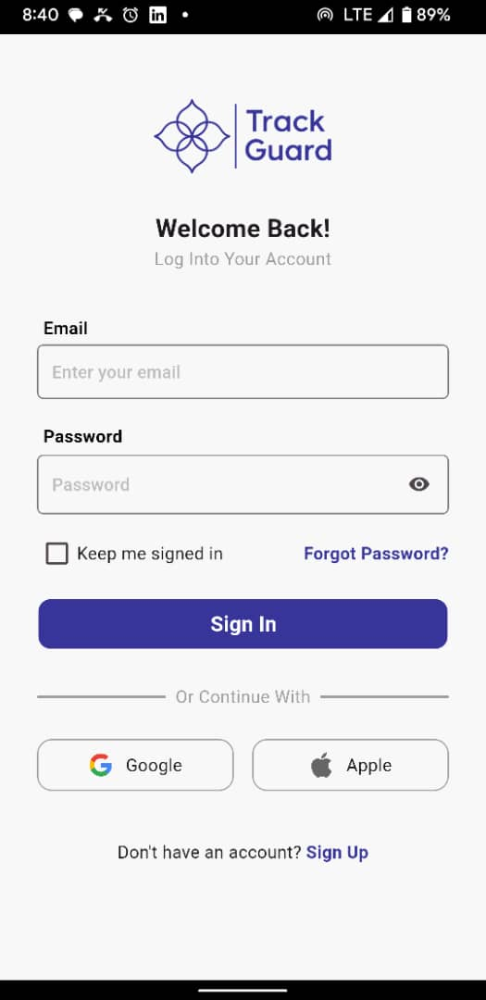
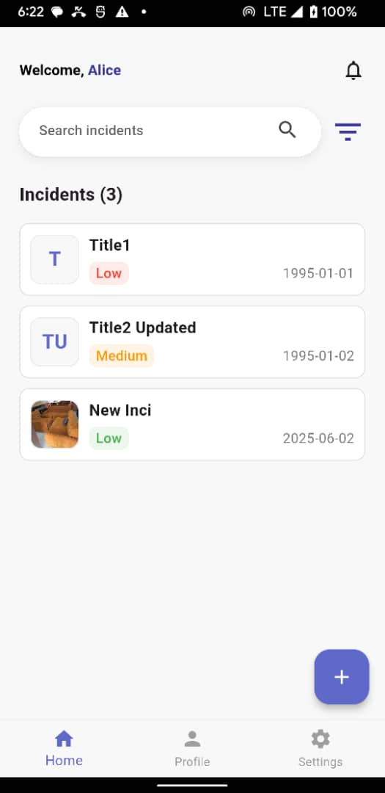
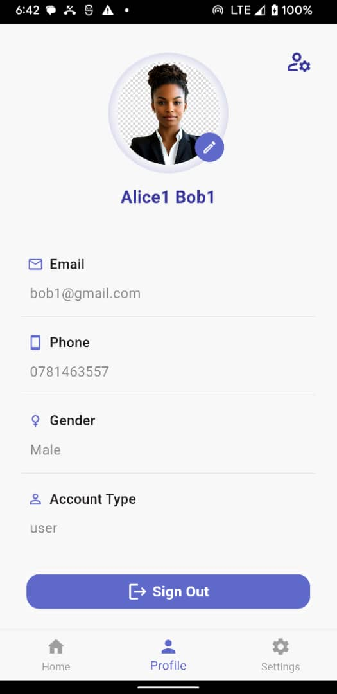

# TrackGuard - Incident Management Flutter App

A comprehensive incident management application built with Flutter that allows users to track, manage, and monitor various incidents with different priority levels.

## 📱 APK Download

[Download APK](https://drive.google.com/file/d/1w7uejDZm9Uey1si-J8_MSfDSSsUN6pFm/view?usp=drive_link)

## 📸 Screenshots

  
  
  

  <strong>Login Screen</strong> &nbsp;&nbsp;&nbsp;&nbsp;&nbsp;&nbsp;&nbsp;&nbsp;&nbsp;&nbsp;&nbsp;&nbsp;&nbsp;&nbsp;&nbsp;&nbsp;&nbsp;&nbsp;&nbsp;&nbsp; <strong>Home Screen</strong> &nbsp;&nbsp;&nbsp;&nbsp;&nbsp;&nbsp;&nbsp;&nbsp;&nbsp;&nbsp;&nbsp;&nbsp;&nbsp;&nbsp;&nbsp;&nbsp;&nbsp;&nbsp;&nbsp;&nbsp; <strong>Profile Screen</strong>

## 🛠️ Tools and Packages Used

### Core Dependencies
- **flutter**: Flutter SDK - The main framework
- **go_router** (^14.2.1): Advanced routing and navigation management
- **provider** (^6.1.5): State management solution
- **sqflite** (^2.3.3): Local SQLite database for data persistence
- **shared_preferences** (^2.3.1): Local key-value storage

### Network & API
- **http** (^1.2.2): HTTP client for API calls
- **dio** (^5.8.0+1): Advanced HTTP client with interceptors

### UI/UX Enhancements
- **shimmer** (^3.0.0): Loading skeleton animations
- **easy_localization** (^3.0.7): Internationalization and localization support
- **fluttertoast** (^8.2.12): Toast notifications

### Media & File Handling
- **image_picker** (^1.1.2): Camera and gallery image selection
- **path_provider** (^2.1.4): File system path management

### Utilities
- **package_info_plus** (^8.1.0): App package information
- **cupertino_icons** (^1.0.6): iOS-style icons

### Development Tools
- **flutter_test**: Testing framework
- **flutter_lints** (^3.0.0): Dart code linting
- **flutter_launcher_icons** (^0.14.1): Custom app icon generation

## ✨ Key Features

- **User Authentication**: Secure login with email/password and social login options
- **Incident Management**: Create, view, and manage incidents with Categories (Low, Medium, High)
- **HomeScreen Overview**: Clean interface showing the list of incidents where you can search or filter by Category or Status
- **Profile Management**: User profile with contact information and account details
- **Local Data Storage**: Offline capability with SQLite database
- **Image Support**: Attach images to incidents using camera or gallery
- **Modern UI**: Clean, intuitive interface with loading animations

## 🏗️ Architecture

The app follows a clean architecture pattern with:
- **MVC Architecture** Model-View-Controller & Services for code structure
- **Provider** for state management
- **SQLite** for local data persistence
- **Go Router** for navigation management
- **Repository pattern** for data layer abstraction

## 📝 Author Declaration

I confirm that this application was fully developed by me during the exam period. I have not received or used code from others except publicly available resources and packages from pub.dev.

---

**Developed with ❤️ using Flutter**